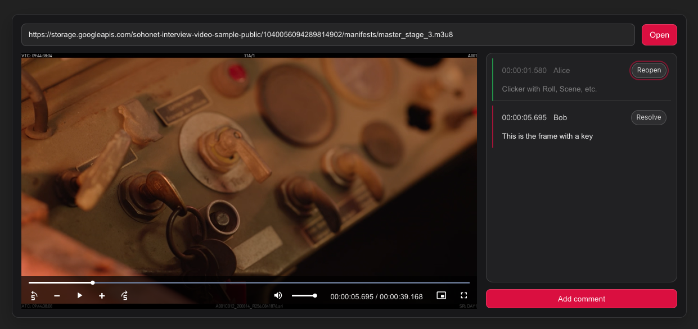

# Video Review Player (test task)

Minimal Video Review Player built with **Vite + React + TypeScript** and **video.js**.

## Features

- **HLS playback** via `video.js`
- **Controls**
  - play/pause, progress bar
  - custom timecode: `HH:MM:SS.ms / HH:MM:SS.ms`
  - seek `±5s`
  - frame step `±1f` (only enabled while paused)
- **Comments**
  - add comment in modal (captures current playback time, pauses on open)
  - click comment to seek
  - resolved / reopen toggle
- **Hotkeys**
  - Space: play/pause
  - ArrowLeft/ArrowRight: seek `±5s`
  - C: open “Add comment”
  - hotkeys are disabled while typing in inputs / when modal is open

## FPS / frame step

Frame step is based on:
- **Primary**: `requestVideoFrameCallback` (measured frame delta)
- **Fallback**: `FRAME-RATE` from the `.m3u8` manifest (if present), otherwise `1/30`

## Getting started

### Prerequisites
- Node.js 18+ (20+ recommended)
- npm

### Install

```bash
npm ci
```

### Run dev server

```bash
npm run dev
```

App runs on `http://localhost:5173`.

## Scripts

- `npm run dev`
- `npm run build`
- `npm run preview`
- `npm run lint`
- `npm test`
- `npm run test:ui`
- `npm run test:coverage`

## Project structure

```
src/
  app/
    App.tsx
    App.module.css
    hooks/
      useReviewHotkeys.ts
  features/
    player/
      VideoPlayer.tsx
      VideoPlayer.module.css
      videojsControls.ts
    comments/
      CommentsBoard.tsx
      CommentsBoard.module.css
      AddCommentModal.tsx
      AddCommentModal.module.css
      comment.ts
  shared/
    utils/
      formatTimecode.ts
      parseM3u8FrameRate.ts
  test/
    setup.ts
  main.tsx
  index.css
```

## Screenshot



## Known issues / tech debt

- **No persistence**: comments live in React state only and are lost on refresh.
- **No error UI for playback / invalid URL**: if `video.js` fails to load a stream, we don’t surface a user-friendly error message.
- **FPS parsing is best-effort**:
  - we fetch the URL and parse `FRAME-RATE` via regex from the manifest text
  - this may fail due to CORS / non-`.m3u8` URLs / missing `FRAME-RATE`
  - if multiple variants exist, we currently take the **max** `FRAME-RATE`, not the selected rendition’s FPS
- **Modal accessibility**: no focus trap (Tab can move focus behind the modal).
- **Comment IDs**: `addComment()` uses `c_${comments.length + 1}`; if we ever add deletion/reordering/import, IDs can collide. A real app would use UUIDs or a monotonic counter.

